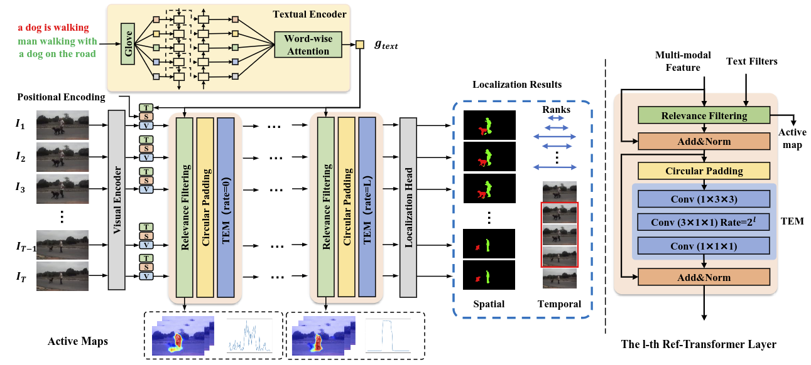

# SAW

The official implementation for paper "Sequence as A Whole: A Unified Framework for Video Action Localization with Long-range Text Query"



We propose a unified framework which handles the whole video in sequential manner with long-range and dense visual-linguistic interaction in an end-to-end manner. Specifically, a lightweight relevance filtering based transformer (Ref-Transformer) is designed, which is composed of relevance filtering based attention and temporally expanded MLP. The text-relevant spatial regions and temporal clips in video can be efficiently highlighted through the relevance filtering and then propagated among the whole video sequence with the temporally expanded MLP. The unified framework can be utilized to varies video-text action localization tasks, e.g., referring video segmentation, temporal sentence grounding, and spatiotemporal video grounding. 

## Requirements

* python 3.8

* pytorch 1.9.1

* torchtext 0.10.1

* flair 0.11.1

## Referring Segmentation

run `cd referring_segmentation` for referring video segmentation task.

### 1. Dataset

Download the A2D Sentences dataset and J-HMDB Sentences dataset from [https://kgavrilyuk.github.io/publication/actor_action/](https://kgavrilyuk.github.io/publication/actor_action/) and convert the videos to RGB frames. The following directory structure is expected:
```python
-A2D
    -Rename_Images
    -a2d_annotation_with_instances
-JHMDB
    -Rename_Images
    -puppet_mask
```
Edit the item `datasets_root` in `json/config.json` to be the current dataset path.

### 2. Word Embedding

Download the Glove embedding from [https://nlp.stanford.edu/projects/glove/](https://nlp.stanford.edu/projects/glove/) and put it into `model/pretrained/`.

### 3. Backbone

Download the pretrained DeepLabResNet from [https://github.com/VainF/DeepLabV3Plus-Pytorch](https://github.com/VainF/DeepLabV3Plus-Pytorch) and put it into `model/pretrained/`. 

### 4. Training

Set the item `"mode"` to `"train“` in `json/config.json` and then please run:
```
python main.py
```
### 5. Evaluation

Set the item `"mode"` to `"test“` in `json/config.json` and then please run:
```
python main.py
``` 

## Temporal Sentence Grounding

run `cd temporal_grounding` for referring temporal sentence grounding task.

### 1. Dataset

* For charades-STA dataset, download the pre-extracted I3D features following [LGI4temporalgrounding](https://github.com/JonghwanMun/LGI4temporalgrounding) and the pre-extracted VGG feature following [2D-TAN](https://github.com/microsoft/VideoX/tree/master/2D-TAN).

* For TACoS dataset, download the pre-extracted C3D features following [2D-TAN](https://github.com/microsoft/VideoX/tree/master/2D-TAN)

* For ActivityNet Captions dataset, download the pre-extracted C3D features from [http://activity-net.org/challenges/2016/download.html](http://activity-net.org/challenges/2016/download.html).

### 2. Training and Evaluation

The config files can be find in `./json` and the following model settings are supported

```
-config_ActivityNet_anchor.json
-config_ActivityNet_regression.json
-config_Charades-STA_I3D_anchor.json
-config_Charades-STA_VGG_anchor.json
-config_Charades-STA_I3D_regression.json
-config_Charades-STA_VGG_regression.json
-config_TACoS_anchor.json
-config_TACoS_regression.json
```

To train on different dataset with different grounding heads, run

```
python main.py --json_file [json file path]
```

For evaluation, set `mode='test'` in the json file and run 

```
python main.py --json_file [json file path]
```

## Spatiotemporal Video Grounding

run `cd spatiotemporal_grounding` for spatiotemporal video grounding task. The code for spatiotemporal grounding is built on the [TubeDETR codebase](https://github.com/antoyang/TubeDETR).

### 1. Dataset

Preparing the `HC-STVG` and `VidSTG` datasets following the [TubeDETR](https://github.com/antoyang/TubeDETR).

### 2. Training and Evaluation

For traning, run

```
python main.py
```

For evaluation, run

```
python main.py --eval
```

## Citation

```
@article{2023saw,
    title     = "{Sequence as A Whole: A Unified Framework for Video Action Localization with Long-range Text Query}",
    author    = {Yuting Su, Weikang Wang, Jing Liu, Shuang Ma, Xiaokang Yang},
    booktitle = {IEEE Transactions on Image Processing},
    year      = {2023}
}
```